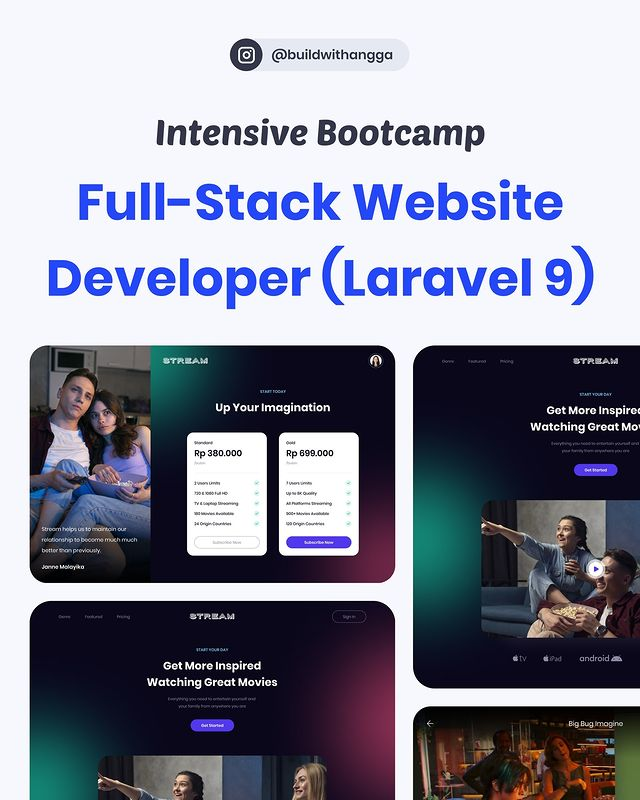

# BWA-Bootcamp Laravel 9

[Intensive Bootcamp Full-Stack Website Developer (Laravel 9)](https://www.instagram.com/p/CZ_Up7KP-8M/) merupakan bootcamp yang diadakan oleh [BuildWithAngga (BWA)](https://buildwithangga.com/). Pada bootcamp tersebut, project yang akan dibangun adalah platform (website) untuk streaming film seperti pada website Netflix, Disney, HBO, dan lainnya, mulai dari user daftar, subscribe dengan Midtrans, dan streaming dari Amazon AWS S3 dan CloudFront.

Tools yang digunakan selama pembangunan project ini adalah:
* Figma
* TailwindCSS
* Laravel
* MySQL
* Zoom
* dll

## Notes

Berikut ini saya juga menyertakan catatan (notes) untuk memudahkan pemahaman akan project yang akan dibangun selama bootcamp berlangsung.
- [Note 01 - Berkenalan dengan Laravel9](notes/2022-04-09-bootcamp-pertemuan-01.md)
- [Note 02 - Setup Project menggunakan Laravel9](notes/2022-04-10-bootcamp-pertemuan-02.md)

## Source Code

Semua kode program yang dipelajari akan di-push ke GitHub [BWA NetStream](https://github.com/ekotwidodo/bwa-netstream)
## Trainer

- Nama : Widada
- Job  : Sr. Backend Developer at Itmi.id
- IG   : @widada17 / @juarakoding