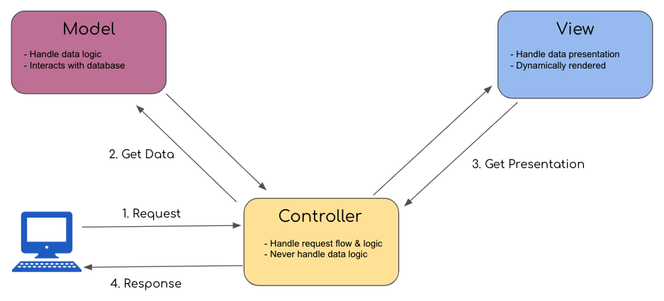
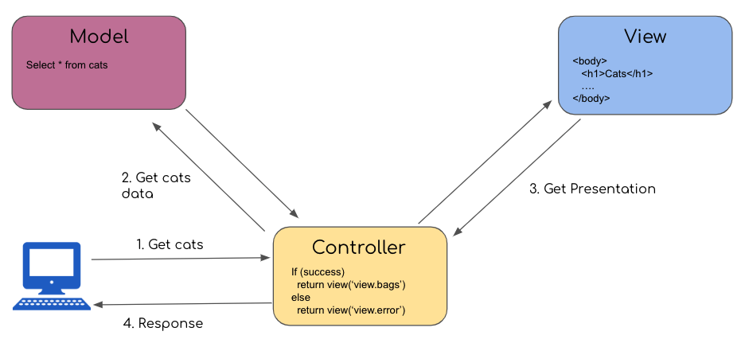

Pada pertemuan pertama, mas Widada menjelaskan banyak tentang bagaimana dalam pembangunan dan pengembangan suatu aplikasi, salah satu caranya adalah dengan menggunakan framework dan juga alasan kenapa menggunakan Laravel. Berikut ini adalah beberapa catatan yang saya dapat.

Alasan menggunakan framework:
* Saving time karena tidak perlu build struktur app dari awal
* Meningkatkan produktivitas
* Mudah berkolaborasi antar programmer
* Kamu bisa fokus membuat fitur dan flow bisnis

Kenapa harus Laravel?
- Komunitas yang besar dan support yang banyak
- Artisan CLI
- Clean & simple routing
- Mudah untuk integrasi dengan 3rd party
- MVC (Model, View, Controller)

Satu hal yang penting adalah MVC, yaitu sebuah arsitektur dimana setiap kode dipisahkan berdasarkan tugasnya masing-masing. Model akan menghandle data logic dan berinteraksi dengan database, View akan menghandle data presentation dan secara dinamis merender tampilan, Controller akan menghandle request flow dan logic, tapi tidak untuk data logic yang sudah dihandle oleh Model.

Untuk lebih memudahkan dalam pemahaman akan MVC, mas Widada juga memberikan contoh konkrit misalkan untuk menampilkan data Cats.

Pada gambar di atas,
1. User ingin mendapatkan data semua Cats, request tersebut akan dikelola oleh Controller
2. Selanjutnya, controller akan memanggil Model untuk mendapatkan data cats tersebut. Di dalam Model sendiri, terdapat data model untuk memanggil semua cats `SELECT * FROM cats`. Hasilnya akan dikembalikan ke Controller.
3. Jika hasilnya adalah `success`, maka data hasil dari Model oleh Controller akan diteruskan ke View `view.bags`, sebaliknya View `view.error`
4. Pada akhirnya adalah respon berupa html format beserta data cats akan dikembalikan ke User.

Untuk membangun/mengembangkan app menggunakan Laravel, ada beberapa syarat yang harus dipenuhi, yaitu
* PHP versi 8
* Composer versi 2
* MySQL
* DB Manager (phpMyadmin, Mysql Workbench, Dbeaver dll)

Sesi selanjutnya adalah `Live Coding` yang mencakup:
- Installasi Laravel
- Penggunaan Artisan CLI: `php artisan ...`
- Routing
- MVC, dan
- Blade