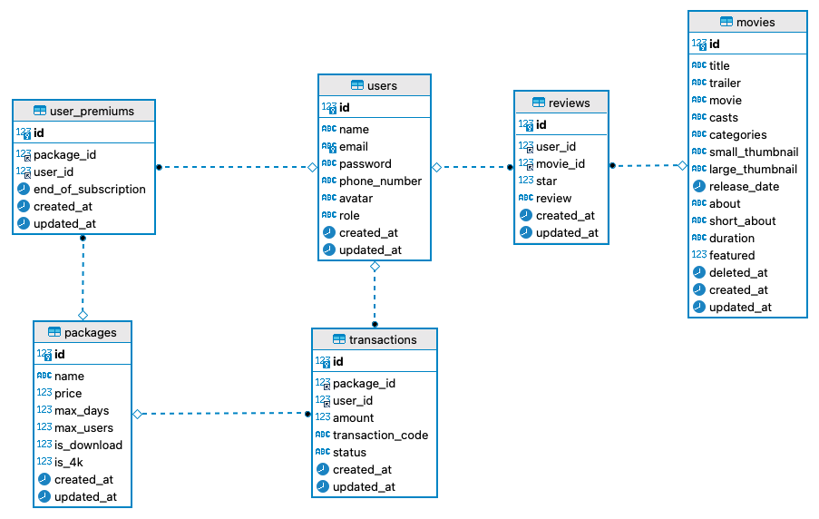
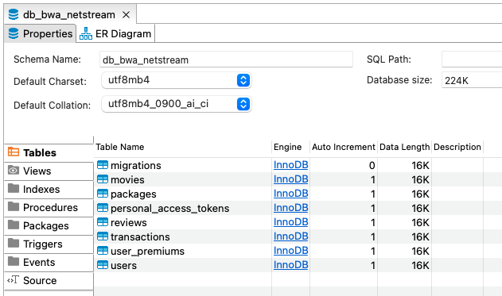
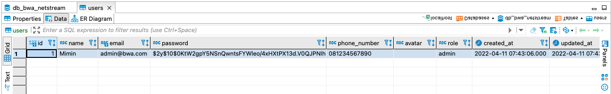
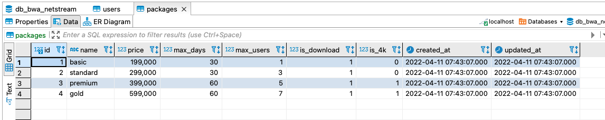

## Setup Project

Pada pertemuan kedua, implementasi pembangunan aplikasi streaming dimulai dengan setup project laravel. Ada beberapa cara untuk membuat project laravel, yaitu dengan menggunakan composer atau laravel installer.

```bash
# Menggunakan composer
composer create-project laravel/laravel <nama-project>
 
# Menggunakan laravel installer
composer global require laravel/installer

laravel new <nama-project>

```

Karena keduanya memerlukan `composer`, maka dari itu, perlu dicek kembali pada pertemuan sebelumnya apakah composser sudah bisa berjalan atau tidak, serta pastikan `PATH` dari composer sudah benar.

- macOS: `$HOME/.composer/vendor/bin`
- Windows: `%USERPROFILE%\AppData\Roaming\Composer\vendor\bin`
- GNU / Linux Distributions: `$HOME/.config/composer/vendor/bin` atau `$HOME/.composer/vendor/bin`

Pada project kali ini, saya akan menamakan project tersebut adalah `bwa-netstream` sehingga saya buat projectnya dengan command:

```bash
composer create-project laravel/laravel bwa-netstream
```

Selanjutnya, ada beberapa file yang perlu kita hapus untuk memudahkan proses selanjutnya, buka `(folder-project) > database > migrations`. Kita bisa menghapus semua file atau hanya menyisakan file `2014_10_12_000000_create_users_table.php`. Dalam kasus ini, saya coba untuk menyisakan satu file tersebut.

## Membuat Migrations

Sebelum membuat migration, ada baiknya kita memahami terlebih dahulu struktur database yang ingin dibangun. Berikut ini adalah ERD dari project yang akan dibangun.



Ada 6 (enam) migration tables yang harus dibuat, yaitu `users`, `movies`, `packages`, `transactions`, `user_premiums`, dan `reviews`. Untuk membuat file migration, kita bisa memanfaatkan Artisan CLI dengan command `php artisan make:migration create_<nama-tabel>_table`, seperti contoh berikut. File-file `<nama-migrasi>.php` akan terbentuk.

```bash
# Migrasi untuk tabel movies
php artisan make:migration create_movies_table
# Migrasi untuk tabel packages
php artisan make:migration create_packages_table
# Migrasi untuk tabel transactions
php artisan make:migration create_transactions_table
# Migrasi untuk tabel user_premiums
php artisan make:migration create_user_premiums_table
# Migrasi untuk tabel reviews
php artisan make:migration create_reviews_table
```

Selanjutnya adalah kita perlu mendefinisikan apa yang ada di dalam function `up` mengimplementasikan sesuai dengan ERD yang telah dibuat. Seperti pada contoh berikut pada table `users`, terdapat beberapa nama kolom yang sudah tersedia, kita perlu mengubahnya.

```php
# Sebelum
public function up()
{
    Schema::create('users', function (Blueprint $table) {
        $table->id();
        $table->string('name');
        $table->string('email')->unique();
        $table->timestamp('email_verified_at')->nullable();
        $table->string('password');
        $table->rememberToken();
        $table->timestamps();
    });
}

# Sesudah
public function up()
{
    Schema::create('users', function (Blueprint $table) {
        $table->id();
        $table->string('name');
        $table->string('email')->unique();
        $table->string('password');
        $table->string('phone_number');
        $table->string('avatar')->nullable();
        $table->enum('role', ['admin', 'member']);
        $table->timestamps();
    });
}
```

Untuk implementasi migration pada tabel berikutnya.

```php

# Migration table movies
Schema::create('movies', function (Blueprint $table) {
    $table->id();
    $table->string('title');
    $table->string('trailer');
    $table->string('movie');
    $table->string('casts');
    $table->string('categories'); // horror, slice of life, etc.
    $table->string('small_thumbnail');
    $table->string('large_thumbnail');
    $table->date('release_date');
    $table->text('about');
    $table->string('short_about');
    $table->string('duration');
    $table->boolean('featured'); // 0-1
    $table->softDeletes(); // menambahkan kolom deleted_at
    $table->timestamps();
});

# Migration table packages
Schema::create('packages', function (Blueprint $table) {
    $table->id();
    $table->string('name');
    $table->float('price');
    $table->integer('max_days');
    $table->integer('max_users');
    $table->boolean('is_download');
    $table->boolean('is_4k');
    $table->timestamps();
});

# Migration table transactions
Schema::create('transactions', function (Blueprint $table) {
    $table->id();
    $table->foreignId('package_id')->constrained('packages');
    $table->foreignId('user_id')->constrained('users');
    $table->float('amount');
    $table->string('transaction_code');
    $table->string('status');
    $table->timestamps();
});

# Migration table user_premiums
Schema::create('user_premiums', function (Blueprint $table) {
    $table->id();
    $table->foreignId('package_id')->constrained('packages');
    $table->foreignId('user_id')->constrained('users');
    $table->date('end_of_subscription');
    $table->timestamps();
});

# Migration table reviews
Schema::create('reviews', function (Blueprint $table) {
    $table->id();
    $table->foreignId('user_id')->constrained('users');
    $table->foreignId('movie_id')->constrained('movies');
    $table->integer('star');
    $table->text('review');
    $table->unique(['user_id', 'movie_id']);
    $table->timestamps();
});
```

Setelah implementasi kode program dilakukan, kita bisa menjalankan fungsi migrasi dengan menggunakan Artisan CLI: `php artisan make:migration`



## Membuat Models

Untuk pembuatan model, kita bisa menggunakan Artisan CLI: `php artisan make:model <nama-model>`. Berikut ini adalah implementasi pembuatan model. File-file model akan tergenerate pada `(folder-project) > app > Models`.

```bash
# Migrasi untuk tabel movies
php artisan make:model Movie
# Migrasi untuk tabel packages
php artisan make:model Package
# Migrasi untuk tabel transactions
php artisan make:model Transaction
# Migrasi untuk tabel user_premiums
php artisan make:model UserPremium
# Migrasi untuk tabel reviews
php artisan make:model Review
```
Jika kita lihat pada file `User.php`, terdapat beberapa variabel spesial, seperti `$fillable`, `$hidden`, dan `$casts`. Variable `$fillable` berguna untuk mendaftarkan atribut (nama kolom) yang bisa kita isi ketika melakukan insert atau update ke database. Variable `$hidden` digunakan untuk menyembunyikan atribut model (kolom tabel) ketika kita memanggil fungsi `toArray()` atau `toJson()`. Variabel `$casts` digunakan untuk merubah suatu value ke dalam bentuk tipe data tertentu. Pada contoh di bawah ini, pada `$fillable` ada tiga atribut yang pada proses insert maupun update harus diisi. Pada `$hidden` variable, ketika dipanggil fungsi `toArray()` maka kolom `password` dan `remember_token` akan disembunyikan. Kemudian untuk variabel `$casts`, kolom `email_verified_at` yang mungkin awalnya adalah `string` diubah ke dalam bentuk `datetime`.

```php
/**
 * The attributes that are mass assignable.
 *
 * @var array<int, string>
 */
protected $fillable = [
    'name',
    'email',
    'password',
];

/**
 * The attributes that should be hidden for serialization.
 *
 * @var array<int, string>
 */
protected $hidden = [
    'password',
    'remember_token',
];

/**
 * The attributes that should be cast.
 *
 * @var array<string, string>
 */
protected $casts = [
    'email_verified_at' => 'datetime',
];
```
Pada project NetStream, untuk model `User.php`, kita akan sesuaikan dengan atribut-atribut yang sudah kita definisikan, sebagai berikut.

```php
protected $fillable = [
    'name',
    'email',
    'password',
    'phone_number',
    'avatar',
    'role'
];

protected $hidden = [
    'password',
    'remember_token',
];
```
Untuk model-model lainnya, berikut ini adalah isiannya. Terdapat variabel `$table` yang merupakan penyesuaian dari tabel yang digunakan di database. Untuk implementasi `SoftDeletes` (menambahkan kolom `delete_at`) pada file `Review.php`, kita bisa lakukan import terlebih dahulu, kemudian menambahkan `SoftDeletes` setelah `HasFactory`.

```php
# Review.php

use Illuminate\Database\Eloquent\SoftDeletes;

use HasFactory, SoftDeletes;

protected $table = 'movies';
protected $fillable = [
    'title',
    'trailer',
    'movie',
    'casts',
    'categories',
    'small_thumbnail',
    'large_thumbnail',
    'release_date',
    'about',
    'short_about',
    'duration',
    'featured'
];

# Package.php
protected $table = 'packages';
protected $fillable = [
    'name',
    'price',
    'max_days',
    'max_users',
    'is_download',
    'is_4k'
];

# Transaction.php
protected $table = 'transactions';
protected $fillable = [
    'package_id',
    'user_id',
    'amount',
    'transaction_code',
    'status'
];

# UserPremium.php
protected $table = 'user_premiums';
protected $fillable = [
    'package_id',
    'user_id',
    'end_of_subscription'
];

# Review.php
protected $table = 'reviews';
protected $fillable = [
    'user_id',
    'movie_id',
    'star',
    'review'
];
```

## Membuat Seeders

Untuk membuat seeder untuk data `dummy`, kita bisa gunakan Artisan CLI: `php artisan make:seeder <nama-seeder>`. Pada contoh kali ini, saya akan mengimplementasikan dua seeder saja, yaitu `UserSeeder` dan `PackageSeeder`. Berikut ini adalah implementasi keduanya.

```bash
php artisan make:seeder UserSeeder

php artisan make:seeder PackageSeeder
```

Setelah file seeder terbentuk di `(folder-project) > database > seeders`. Berikut ini adalah isian yang ada di dalam file `UserSeeder.php`.

```php
<?php

namespace Database\Seeders;

use Illuminate\Database\Console\Seeds\WithoutModelEvents;
use Illuminate\Database\Seeder;

class UserSeeder extends Seeder
{
    /**
     * Run the database seeds.
     *
     * @return void
     */
    public function run()
    {
        //
    }
}
```

Untuk membuat data `dummy`, kita perlu menambahkan baris kode di dalam fungsi `run()`. Kita perlu melakukan import `DB` untuk memanggil Eloquent di Laravel, seperti `insert` dan `Hash` untuk enkripsi kolom `password`. Untuk `created_at` dan `updated_at`, kita bisa gunakan fungsi `now()`.

```php
# import
use Illuminate\Support\Facades\DB;
use Illuminate\Support\Facades\Hash;

# implementasi
DB::table('users')->insert([
    'name' => 'Mimin',
    'email' => 'admin@bwa.com',
    'password' => Hash::make('mantapjiwa'),
    'phone_number' => '081234567890',
    'avatar' => '',
    'role' => 'admin',
    'created_at' => now(),
    'updated_at' => now()
]);
```

Untuk file `PackageSeeder.php`, kita hanya perlu import `DB` dan implementasi data `dummy` adalah sebagai berikut.

```php
DB::table('packages')->insert([
    [
        'name' => 'basic',
        'price' => 199000,
        'max_days' => 30,
        'max_users' => 1,
        'is_download' => 1,
        'is_4k' => 0,
        'created_at' => now(),
        'updated_at' => now()
    ],
    [
        'name' => 'standard',
        'price' => 299000,
        'max_days' => 30,
        'max_users' => 3,
        'is_download' => 1,
        'is_4k' => 0,
        'created_at' => now(),
        'updated_at' => now()
    ],
    [
        'name' => 'premium',
        'price' => 399000,
        'max_days' => 60,
        'max_users' => 5,
        'is_download' => 1,
        'is_4k' => 1,
        'created_at' => now(),
        'updated_at' => now()
    ],
    [
        'name' => 'gold',
        'price' => 599000,
        'max_days' => 60,
        'max_users' => 7,
        'is_download' => 1,
        'is_4k' => 1,
        'created_at' => now(),
        'updated_at' => now()
    ],
]);
```

Bagaimana cara menjalankannya? Ada dua cara:
1. Dengan menggunakan Artisan CLI: `php artisan db:seed --class=<nama-seeder>`. Kita bisa menjalankan seeder tertentu.
   
   ```bash
   php artisan db:seed --class=UserSeeder

   php artisan db:seed --class=PackageSeeder
   ```

2. Dengan memanfaatkan file `DatabaseSeeder.php`. Kita bisa `either` menjalankan satu-satu atau bisa sekaligus. Untuk perintahnya, cukup gunakan Artisan CLI: `php artisan db:seed`
   
   ```php
   # DatabaseSeeder.php

    public function run()
    {
        $this->call([
            UserSeeder::class,
            PackageSeeder::class
        ]);
    }
   ```
Berikut ini adalah hasilnya.




## Source Code Project

Semua kode program yang dipelajari akan di-push ke GitHub [BWA NetStream](https://github.com/ekotwidodo/bwa-netstream)